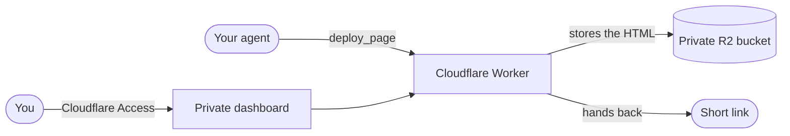

<div align="center">

# PagePilot

**Your agent writes HTML. PagePilot lands it on a link.**

A plan, a mock, a report. One tool call publishes it and hands back a URL you can open
anywhere.

[Live site](https://pagepilot.rafay99.com) · [Run locally](docs/run-locally.md) ·
[Deploy](docs/deploy.md) · [Private dashboard](docs/private-dashboard.md) ·
[Connect an agent](docs/connect-an-agent.md)

</div>

## What it is

Agents are good at writing HTML and bad at showing it to you. PagePilot fixes the second
part. Your agent sends a page of HTML over MCP, PagePilot stores it in your own private R2
bucket, and the agent gets a short link back.

One Cloudflare Worker runs all of it. There is no database and no separate login service.
A private dashboard, guarded by Cloudflare Access, lets you search, preview and delete
what your agents published.

## The route



1. **Departure.** The agent calls `deploy_page` at `/api/mcp` with a Bearer key.
2. **In flight.** The Worker caps the page at 900 KB, gives it a 128 bit id nobody can
   guess and a deletion key it shows once.
3. **Hangar.** R2 keeps the file in one private bucket.
4. **Arrival.** You get `/p/<id>`. It opens on any device, sandboxed and never indexed,
   and it is gone the moment you delete it.

## Quick start

```bash
bun install
cp .dev.vars.example .dev.vars
bun run dev
```

PagePilot is now running at `http://localhost:8787` against an emulated bucket, so
nothing touches real storage. [Run locally](docs/run-locally.md) shows how to publish
your first page.

## Guides

| Guide                                          | What it covers                                        |
| ---------------------------------------------- | ----------------------------------------------------- |
| [Run locally](docs/run-locally.md)             | Start the Worker on your machine, publish a test page |
| [Deploy to Cloudflare](docs/deploy.md)         | Bucket, API key, first deploy, your own domain        |
| [Private dashboard](docs/private-dashboard.md) | Create the Cloudflare Access application and sign in  |
| [Connect an agent](docs/connect-an-agent.md)   | MCP settings and the three tools                      |
| [Reference](docs/reference.md)                 | Routes, storage, privacy, project layout              |

## One thing to know

A page link is unlisted, not private. Anyone holding `/p/<id>` can read the page, so do
not publish secrets. The API key guards publishing, listing and deleting. Cloudflare
Access guards the dashboard. The [reference](docs/reference.md#privacy) has the details.
